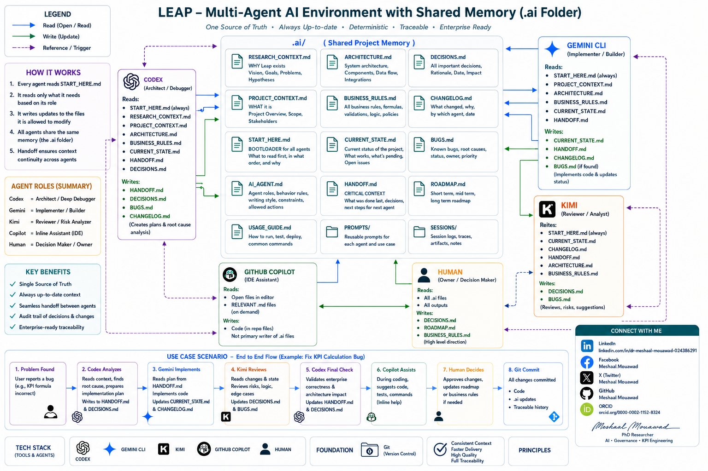

<div align="center">


# 🧠 Multi-Agent AI System (Shared Memory for Multi-Agent AI Projects)
### Scalable Cognitive Architecture with Shared Memory for Collaborative Intelligence

[](https://opensource.org/licenses/MIT)
[](https://www.python.org/)
[](https://www.docker.com/)

</div>

---

## 📑 Executive Summary
This project represents a sophisticated framework for coordinating autonomous agents in a shared memory environment. Designed for high-performance AI research, it bridges the gap between individual agent reasoning and collective, context-aware decision-making. Simply, it helps ChatGPT, Gemini, Codex, Copilot, Claude, DeepSeek, Kimi, Cascade, and other agents work from the same project context instead of repeatedly rediscovering the project.

## Why this exists

When multiple AI agents work on one project, they often suffer from repeated explanations, inconsistent assumptions, forgotten decisions, duplicated debugging, hallucinated architecture, higher token cost, and weak handoffs.

mrAI solves this by making the **project remember itself** through a simple `.ai/` folder.

## Core idea

```text
Human → .ai shared memory → AI agents → project changes → .ai updated → next agent continues
```

## Benefits

- Lower AI usage cost by avoiding repeated rediscovery
- Less contextual hallucination
- Better project handoffs
- Safer debugging and refactoring
- Durable decisions and risk history
- Useful for software engineering, governance, project management, research, and knowledge management


---

## 🛠 Technical Architecture
A modular approach ensuring extensibility and robust performance.




<details>
<summary><b>View System Components</b></summary>

- **Core Engine:** Orchestrates agent lifecycles and task distribution.
- **Shared Memory Layer:** Redis-based backend for real-time state synchronization.
- **Cognitive Proxy:** Standardized interface for LLM integration.
- **Monitoring & Metrics:** Integrated observability for agent performance tracking.
</details>

---

## 🚀 Getting Started

```bash
# Clone the repository
git clone [https://github.com/Meshaal-Mouawad/Multi-Agent-AI-Enviroment-With-Shared-Memory-ai.git](https://github.com/Meshaal-Mouawad/Multi-Agent-AI-Enviroment-With-Shared-Memory-ai.git)

# Initialize environment
docker-compose up -d


## Quick start

1. Copy `.ai/` into your repository.
2. Fill `PROJECT_CONTEXT.md`.
3. Ask any agent:

```text
Read `.ai/START_HERE.md` before doing anything.
```

4. After important work, ask the agent to update shared memory.

## Important principle

> Conversation history is not shared memory.

Only durable written files in `.ai/` count as shared memory.

## Suggested workflow

```text
Read START_HERE
  ↓
Diagnose
  ↓
Implement narrowly
  ↓
Human verifies
  ↓
Update .ai
  ↓
Next agent continues
```

## Cheapkeeper Strategy Algorithm 😂

Use cheaper/free agents first. Use expensive models only for hard diagnosis or final review.

> Never pay twice for the same understanding.

## GitHub safety

Do not commit secrets, API keys, private customer data, confidential architecture, or sensitive business information.


## Author 
- LinkedIn: https://www.linkedin.com/in/dr-meshaal-mouawad-024386291
- ORCID: https://orcid.org/0000-0002-1152-8324
- GitHub: Meshaal Mouawad
- X: Meshaal Mouawad
- Facebook: Meshaal.Mouawad
- Email: mm4922@msstate.edu
