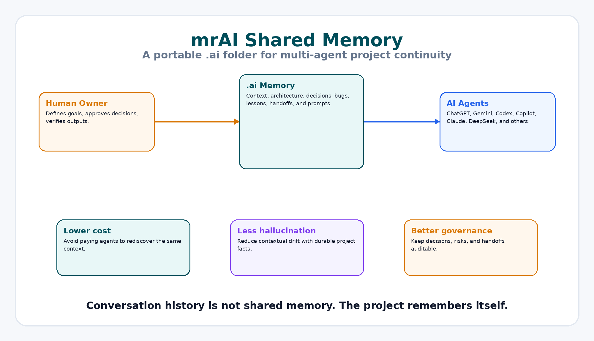
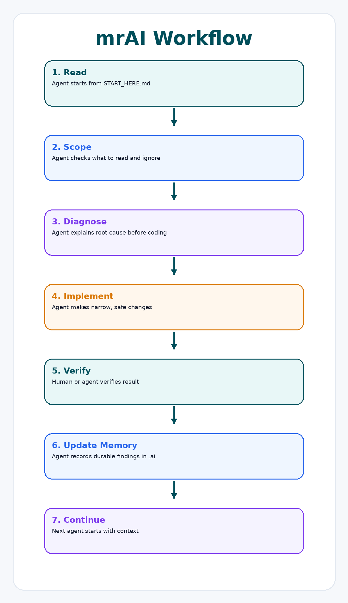

# mrAI — Shared Memory for Multi-Agent AI Projects

**mrAI** is a lightweight shared-memory framework for teams using multiple AI agents on the same project.

It helps ChatGPT, Gemini, Codex, Copilot, Claude, DeepSeek, Kimi, Cascade, and other agents work from the same project context instead of repeatedly rediscovering the project.



## Why this exists

When multiple AI agents work on one project, they often suffer from repeated explanations, inconsistent assumptions, forgotten decisions, duplicated debugging, hallucinated architecture, higher token cost, and weak handoffs.

mrAI solves this by making the **project remember itself** through a simple `.ai/` folder.

## Core idea

```text
Human → .ai shared memory → AI agents → project changes → .ai updated → next agent continues
```

## Benefits

- Lower AI usage cost by avoiding repeated rediscovery
- Less contextual hallucination
- Better project handoffs
- Safer debugging and refactoring
- Durable decisions and risk history
- Useful for software engineering, governance, project management, research, and knowledge management



## Quick start

1. Copy `.ai/` into your repository.
2. Fill `PROJECT_CONTEXT.md`.
3. Ask any agent:

```text
Read `.ai/START_HERE.md` before doing anything.
```

4. After important work, ask the agent to update shared memory.

## Important principle

> Conversation history is not shared memory.

Only durable written files in `.ai/` count as shared memory.

## Suggested workflow

```text
Read START_HERE
  ↓
Diagnose
  ↓
Implement narrowly
  ↓
Human verifies
  ↓
Update .ai
  ↓
Next agent continues
```

## Cheapkeeper Strategy Algorithm

Use cheaper/free agents first. Use expensive models only for hard diagnosis or final review.

> Never pay twice for the same understanding.

## GitHub safety

Do not commit secrets, API keys, private customer data, confidential architecture, or sensitive business information.

## Author / Contact

Created by **Dr. Meshaal Mouawad**

- LinkedIn: https://www.linkedin.com/in/dr-meshaal-mouawad-024386291
- ORCID: https://orcid.org/0000-0002-1152-8324
- GitHub: Meshaal Mouawad
- X: Meshaal Mouawad
- Facebook: Meshaal.Mouawad
- Email: mm4922@msstate.edu
